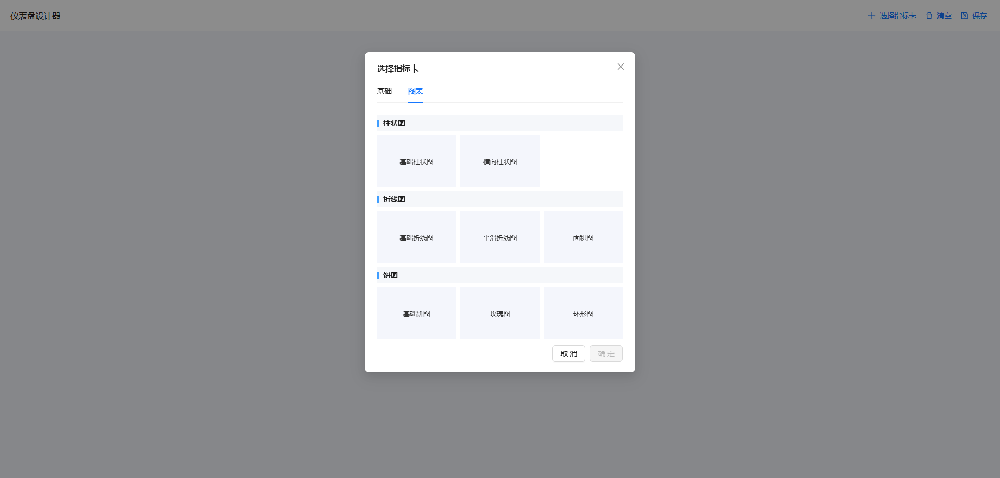
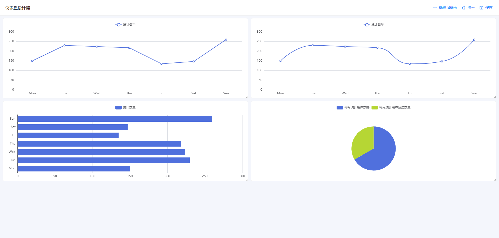

# BI Design 工具

## 项目描述

BI Design 是一个基于 Vue 3 + TypeScript + Vite 开发的商业智能设计工具，用于快速构建和配置数据可视化仪表盘。该工具提供了丰富的图表组件和拖拽布局功能，使用户能够轻松创建专业的数据可视化界面。

## 预览图





## 功能特性

- **拖拽布局**：支持通过拖拽方式自由调整组件位置和大小
- **丰富的图表组件**：包含柱状图、折线图、饼图等多种图表类型
- **灵活的配置选项**：每个组件都有详细的配置参数
- **响应式设计**：适配不同屏幕尺寸
- **数据可视化**：基于 ECharts 实现丰富的数据展示效果
- **模块化架构**：组件化设计，易于扩展和维护

## 技术栈

- **前端框架**：Vue 3 + TypeScript + Vite
- **UI 组件库**：Ant Design Vue
- **图表库**：ECharts
- **状态管理**：Pinia
- **路由管理**：Vue Router
- **HTTP 客户端**：Axios
- **日期处理**：Day.js
- **网格布局**：vue-grid-layout-v3
- **ID 生成**：UUID

## 安装和运行

### 环境要求

- Node.js 16.0 或更高版本
- pnpm 7.0 或更高版本

### 安装依赖

```bash
pnpm install
```

### 开发模式运行

```bash
pnpm dev
```

### 构建生产版本

```bash
pnpm build
```

### 预览生产构建

```bash
pnpm preview
```

## 项目结构

```
├── public/            # 静态资源
├── src/
│   ├── api/           # API 接口
│   ├── assets/        # 资源文件
│   ├── components/    # 通用组件
│   ├── designer/      # 设计器核心组件
│   │   ├── GridCanvas/    # 网格画布
│   │   ├── HeaderBar/     # 头部栏
│   │   └── components/    # 设计器相关组件
│   ├── enums/         # 枚举定义
│   ├── hooks/         # 自定义钩子
│   ├── packages/      # 组件库
│   │   ├── Basic/     # 基础组件
│   │   └── Charts/    # 图表组件
│   ├── router/        # 路由配置
│   ├── store/         # 状态管理
│   ├── styles/        # 样式文件
│   ├── utils/         # 工具函数
│   ├── views/         # 页面视图
│   ├── App.vue        # 应用入口组件
│   └── main.ts        # 应用入口文件
├── types/             # TypeScript 类型定义
├── .gitignore
├── index.html
├── package.json
├── pnpm-lock.yaml
├── tsconfig.app.json
├── tsconfig.json
├── tsconfig.node.json
└── vite.config.ts
```

## 核心组件

### 设计器组件

- **GridCanvas**：网格画布，用于放置和调整组件
- **HeaderBar**：头部栏，包含保存、预览等操作
- **addMetricModal**：添加指标模态框
- **configModal**：配置模态框
- **saveModal**：保存模态框

### 图表组件

- **Bars**：柱状图系列
  - BarCommon：普通柱状图
  - BarCrossrange：跨范围柱状图
- **Lines**：折线图系列
  - LineArea：面积折线图
  - LineCommon：普通折线图
  - LineSmooth：平滑折线图
- **Pies**：饼图系列
  - PieCommon：普通饼图
  - PieRing：环形饼图
  - PieRose：玫瑰饼图

### 基础组件

- **Statistic**：统计数字组件

## 自定义钩子

- **use-aside**：侧边栏管理
- **use-chart-data**：图表数据处理
- **use-drag-layout**：拖拽布局管理

## 快速开始

1. 克隆项目到本地
2. 安装依赖：`pnpm install`
3. 启动开发服务器：`pnpm dev`
4. 在浏览器中打开 `http://localhost:5173` 访问应用
5. 使用拖拽功能添加组件到画布
6. 点击组件配置按钮调整组件参数
7. 点击保存按钮保存当前设计

## 许可证

MIT
